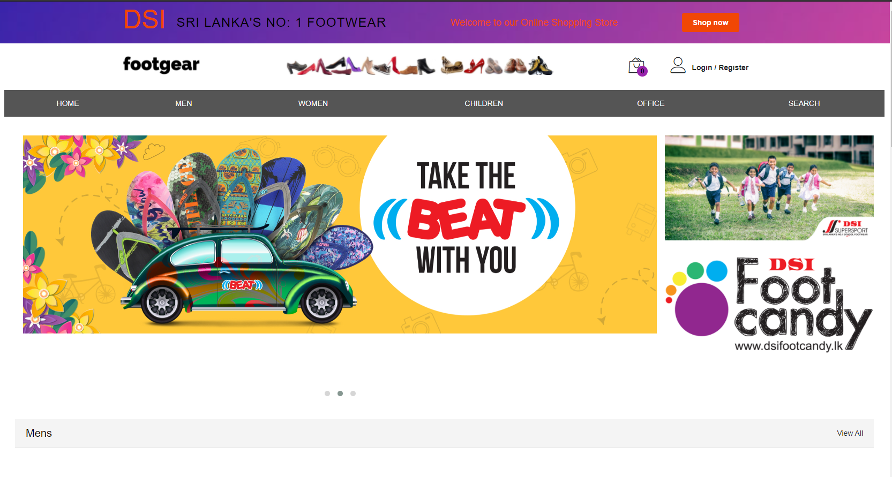
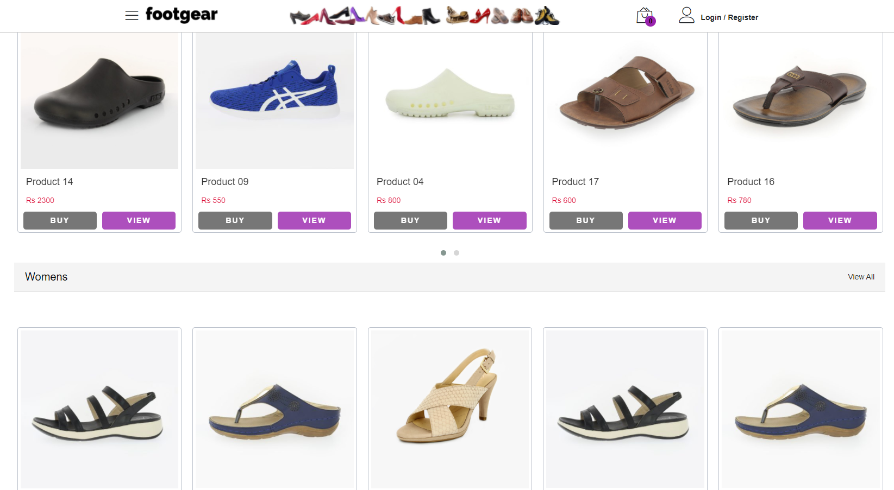
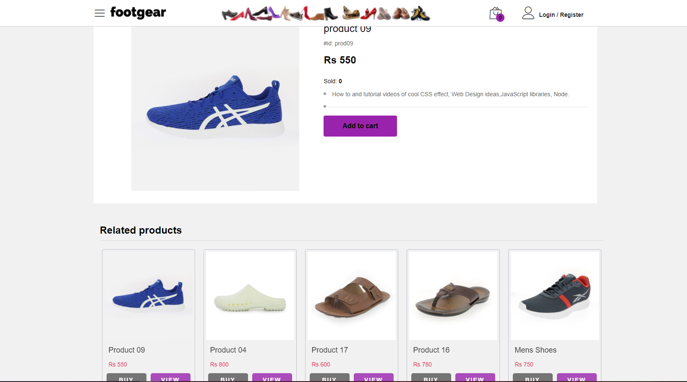
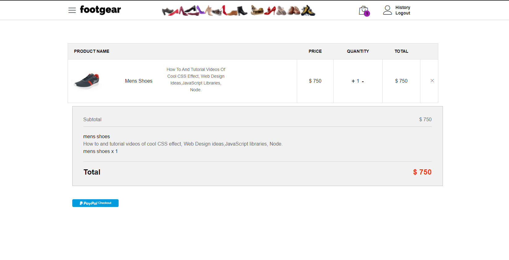

# MERN Stack - Ecommerce
> Ecommerce website built with the MERN stack with React Context API for state management, pure CSS for style

## Author: Kavindu Madushanka

## Install dependencies for server 
### `npm install`

## Install dependencies for client
### cd client ---> `npm install`

## Connect to your mongodb and add info in .env

## Add your paypal client id in client/src/components/mainpages/cart/PaypalButton.js

## Run the client & server with concurrently
### `npm run dev`

## Run the Express server only
### `npm run server`

## Run the React client only
### `npm run client`

### Server runs on http://localhost:5000 and client on http://localhost:3000

